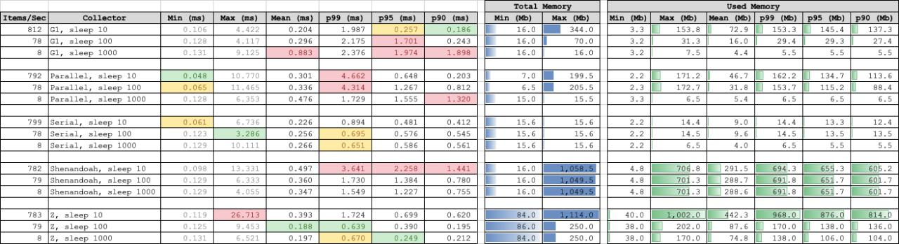

# gc-stop-of-the-world

*How does GC affect your Java application?*

This question is straightforward but it is not easy to answer as there are so many factors to be looked at:
- Nature of the application: is it a giant monolith enterprise application with a lot of data
and few concurent users. or is it a microservice with some APIs and serves many concurrent
requests from multiple clients?
- GC types and other JVM tunings: the JVM does not have one single GC implementations.
In fact, [it has many](https://docs.oracle.com/en/java/javase/11/gctuning/available-collectors.html#GUID-9E4A6B11-BB94-424F-90EF-401287A1C333)
and you can explicitly choose one via a JVM's command line option.

Fortunately, there is a simple way to find out the answer: code it! This repo contains a small
Java application that mimics the memory consumption of a multi-threaded microservice and prints
out stats of memory usage as well as memory allocation latency:
- It starts `n` threads (configured via `-DnumThreads=n`)
- Each thread loops `k` times (configured via `-DnumLoops=k`). For each loop:
  - Allocate a small block of memory (default 1Mb, configured via `-DblockSize=sizeInBytes`).
  - De-reference the block (set the variable to `null`).
  - Randomly sleep for up to `t` milliseconds (configured via `-DsleepTime=t`)

Memory usage and duration required to allocate each memory block are recorded and stats is printed out when all threads finish execution.

Below is the result of my own test with the following configurations:

- Machine: GCP's `n1-standard-4`
- OS: `CentOS Linux 7 (Core) - 3.10.0-957.27.2.el7.x86_64`
- Java: `OpenJDK 64-Bit Server VM 18.9 (build 11.0.4+11-LTS, mixed mode, sharing)`

Collectors to test: `G1`, `Parallel`, `Serial`, `Shenandoah` and `Z` (with `-XX:+UnlockExperimentalVMOptions`).
Each collector is executed 3 times with `sleepTime` of `10`, `100` and `1000` milliseconds.

## Test 1: numThreads=4, numLoops=1000, blockSize=1048576

> All tests run with JVM options:
>
> `-server -XX:+ExitOnOutOfMemoryError -XX:+CrashOnOutOfMemoryError -Xms16m -Xmx1234m -XX:MinHeapFreeRatio=5 -XX:MaxHeapFreeRatio=10 -XX:-ShrinkHeapInStep`

**Latency Stats**

_Numbers are rounded to 3 decimal digits_

| Collector              | Min (ms) | Max (ms) | Mean (ms) | p99 (ms) | p95 (ms) | p90 (ms) |
|------------------------|---------:|---------:|----------:|---------:|---------:|---------:|
| G1, sleep 10           |    0.106 | 	 4.422 |	 0.204 |	1.987 |	   0.257 |	  0.186 |
| G1, sleep 100          |    0.128 |	 4.117 |	 0.296 |	2.175 |	   1.701 |	  0.243 |
| G1, sleep 1000         |    0.131 |	 9.125 |	 0.883 |	2.376 |	   1.974 |	  1.898 |
| Parallel, sleep 10     |    0.048 |	10.770 |	 0.301 |	4.662 |	   0.648 |	  0.203 |
| Parallel, sleep 100    |    0.065 |	11.465 |	 0.336 |	4.314 |	   1.267 |	  0.812 |
| Parallel, sleep 1000   |    0.128 |	 6.353 |	 0.476 |	1.729 |	   1.555 |	  1.320 |
| Serial, sleep 10       |    0.061 |	 6.736 |	 0.226 |	0.894 |	   0.481 |	  0.412 |
| Serial, sleep 100      |    0.123 |	 3.286 |	 0.256 |	0.695 |	   0.576 |	  0.545 |
| Serial, sleep 1000     |    0.129 |	10.111 |	 0.266 |	0.651 |	   0.586 |	  0.561 |
| Shenandoah, sleep 10   |    0.098 |	13.331 |	 0.497 |	3.641 |	   2.258 |	  1.441 |
| Shenandoah, sleep 100  |    0.129 |	 6.333 |	 0.360 |	1.730 |	   1.384 |	  0.780 |
| Shenandoah, sleep 1000 |    0.129 |	 4.055 |	 0.347 |	1.549 |	   1.227 |	  0.755 |
| Z, sleep 10            |    0.119 |	26.713 |	 0.393 |	1.724 |	   0.699 |	  0.620 |
| Z, sleep 100           |    0.125 |	 9.453 |	 0.188 |	0.639 |	   0.390 |	  0.195 |
| Z, sleep 1000          |    0.131 |	 6.521 |	 0.197 |	0.670 |	   0.249 |	  0.212 |

**Memory Usage**

| Collector              | Min (mb) | Max (mb) | Mean (mb) | p99 (mb) | p95 (mb) | p90 (mb) |
|------------------------|---------:|---------:|----------:|---------:|---------:|---------:|
| G1, sleep 10           |      3.3 |	 153.8 |	  72.9 |	153.3 |	   145.4 |	  137.3 |
| G1, sleep 100          |      3.2 |	  31.3 |	  16.0 |	 29.4 | 	29.3 |	   27.4 |
| G1, sleep 1000         |      3.2 |	   7.5 |	   4.4 |	  5.5 |	     5.5 |	    5.5 |
| Parallel, sleep 10     |      2.2 |	 171.2 |	  46.7 |	162.2 |	   134.7 |	  113.6 |
| Parallel, sleep 100    |      2.3 |	 172.7 |	  31.8 |	153.7 |	   115.2 |	   88.4 |
| Parallel, sleep 1000   |      3.3 |	   6.5 |	   5.4 |	  6.5 |	     6.5 |	    6.5 |
| Serial, sleep 10       |      2.2 |	  14.4 |	   9.0 |	 14.4 |	    13.3 |	   12.4 |
| Serial, sleep 100      |      2.2 |	  14.5 |	   9.6 |	 14.5 |	    13.5 |	   13.5 |
| Serial, sleep 1000     |      2.2 |	   6.5 |	   4.0 |	  6.5 |	     5.5 |	    5.5 |
| Shenandoah, sleep 10   |      4.8 |	 706.8 |	 291.5 |	694.3 |	   655.3 |	  605.2 |
| Shenandoah, sleep 100  |      4.8 |	 701.3 |	 288.7 |	691.8 |	   651.7 |	  601.7 |
| Shenandoah, sleep 1000 |      4.8 |	 701.3 |	 288.6 |	691.8 |	   651.7 |	  601.7 |
| Z, sleep 10            |     40.0 |  1,002.0 |	 442.3 |	968.0 |	   876.0 |	  814.0 |
| Z, sleep 100           |     38.0 |	 202.0 |	  87.6 |	170.0 |	   138.0 |	  136.0 |
| Z, sleep 1000          |     38.0 |	 170.0 |	  74.8 |	138.0 |	   106.0 |	  104.0 |

## Test 2: numThreads=16, numLoops=1000, blockSize=1048576

> All tests run with JVM options:
>
> `-server -XX:+ExitOnOutOfMemoryError -XX:+CrashOnOutOfMemoryError -Xms16m -Xmx1234m -XX:MinHeapFreeRatio=5 -XX:MaxHeapFreeRatio=10 -XX:-ShrinkHeapInStep`

**Latency Stats**

_Numbers are rounded to 3 decimal digits_

| Collector              | Min (ms) | Max (ms) | Mean (ms) | p99 (ms) | p95 (ms) | p90 (ms) |
|------------------------|---------:|---------:|----------:|---------:|---------:|---------:|
| G1, sleep 10           |    0.114 |	26.611 |	 0.259 |	 2.645 |   0.299 |	  0.225 |
| G1, sleep 100          |    0.121 |	11.647 |	 0.209 |	 1.975 |   0.230 |	  0.179 |
| G1, sleep 1000         |    0.127 |	12.080 |	 0.360 |	 2.095 |   1.841 |	  1.145 |
| Parallel, sleep 10     |    0.047 |	28.573 |	 0.267 |	 5.314 |   0.250 |	  0.207 |
| Parallel, sleep 100    |    0.064 |	14.955 |	 0.175 |	 0.571 |   0.174 |	  0.159 |
| Parallel, sleep 1000   |    0.076 |	11.991 |	 0.262 |	 1.890 |   0.980 |	  0.213 |
| Serial, sleep 10       |    0.041 |	33.446 |	 1.044 |	10.133 |   6.464 |	  2.800 |
| Serial, sleep 100      |    0.097 |	14.490 |	 0.269 |	 0.968 |   0.576 |	  0.525 |
| Serial, sleep 1000     |    0.125 |	18.557 |	 0.286 |	 0.731 |   0.625 |	  0.595 |
| Shenandoah, sleep 10   |    0.121 |	74.189 |	 0.813 |	19.124 |   1.907 |	  0.243 |
| Shenandoah, sleep 100  |    0.124 |	 7.310 |	 0.189 |	 0.882 |   0.416 |	  0.200 |
| Shenandoah, sleep 1000 |    0.126 |	 4.078 |	 0.197 |	 0.710 |   0.447 |	  0.213 |
| Z, sleep 10            |    0.113 |	89.410 |	 0.335 |	 0.929 |   0.620 |	  0.233 |
| Z, sleep 100           |    0.121 |	16.970 |	 0.176 |	 0.622 |   0.202 |	  0.175 |
| Z, sleep 1000          |    0.129 |	 9.812 |	 0.173 |	 0.605 |   0.200 |	  0.187 |

**Memory Usage**

| Collector              | Min (mb) | Max (mb) | Mean (mb) | p99 (mb) | p95 (mb) | p90 (mb) |
|------------------------|---------:|---------:|----------:|---------:|---------:|---------:|
| G1, sleep 10           |      3.3 |	 231.8 |	 113.6 |	227.9 |	   219.3 |	  205.9 |
| G1, sleep 100          |      3.3 |	  76.0 |	  38.3 |	 74.0 |	    71.4 |	   67.6 |
| G1, sleep 1000         |      3.3 |	  31.6 |	  10.6 |	 18.0 |	    18.0 |	   17.5 |
| Parallel, sleep 10     |      3.3 |	 410.7 |	 182.3 |	405.7 |	   383.7 |	  355.7 |
| Parallel, sleep 100    |      2.3 |	 410.7 |	 201.1 |	406.7 |	   389.5 |	  367.7 |
| Parallel, sleep 1000   |      2.3 |	 406.6 |	 116.6 |	370.1 |	   318.6 |	  281.4 |
| Serial, sleep 10       |      3.3 |	  18.4 |	  11.1 |	 14.6 |	    14.4 |	   13.6 |
| Serial, sleep 100      |      3.3 |	  18.4 |	  11.1 |	 14.6 |	    14.4 |	   13.6 |
| Serial, sleep 1000     |      2.3 |	  17.4 |	   8.8 |	 16.3 |	    13.6 |	   12.6 |
| Shenandoah, sleep 10   |      5.2 |	 720.2 |	 352.8 |	704.2 |	   674.2 |	  636.2 |
| Shenandoah, sleep 100  |      4.6 |	 706.1 |	 346.0 |	697.1 |	   667.1 |	  631.1 |
| Shenandoah, sleep 1000 |      4.8 |	 704.3 |	 345.0 |	696.3 |	   666.3 |	  630.3 |
| Z, sleep 10            |     38.0 |  1,098.0 |	 268.9 |	680.0 |	   490.0 |	  424.0 |
| Z, sleep 100           |     38.0 |	 462.0 |	 132.1 |	364.0 |	   234.0 |	  202.0 |
| Z, sleep 1000          |     38.0 |	 202.0 |	  79.2 |	168.0 |	   136.0 |	  136.0 |

## Test 3: numThreads=64, numLoops=1000, blockSize=1048576

> All tests run with JVM options:
>
> `-server -XX:+ExitOnOutOfMemoryError -XX:+CrashOnOutOfMemoryError -Xms16m -Xmx1234m -XX:MinHeapFreeRatio=5 -XX:MaxHeapFreeRatio=10 -XX:-ShrinkHeapInStep`

**Latency Stats**

_Numbers are rounded to 3 decimal digits_

| Collector              | Min (ms) | Max (ms) | Mean (ms) | p99 (ms) | p95 (ms) | p90 (ms) |
|------------------------|---------:|---------:|----------:|---------:|---------:|---------:|
| G1, sleep 10           |    0.114 |	60.220 |	 1.349 |   16.413 |	   7.862 |	  3.947 |
| G1, sleep 100          |    0.117 |	29.938 |	 0.219 |	2.093 |	   0.255 |	  0.205 |
| G1, sleep 1000         |    0.123 |	42.617 |	 0.257 |	2.053 |	   1.066 |	  0.197 |
| Parallel, sleep 10     |    0.090 |  114.594 |	 0.519 |	8.792 |	   0.254 |	  0.226 |
| Parallel, sleep 100    |    0.047 |  127.121 |	 0.244 |	0.355 |	   0.195 |	  0.170 |
| Parallel, sleep 1000   |    0.066 |	53.084 |	 0.191 |	0.280 |	   0.179 |	  0.169 |
| Serial, sleep 10       |    0.051 |  279.767 |	26.657 |  150.036 |	 106.703 |	 85.245 |
| Serial, sleep 100      |    0.043 |  135.802 |	 0.775 |   13.512 |	   1.118 |	  0.627 |
| Serial, sleep 1000     |    0.102 |	96.826 |	 0.256 |	0.801 |	   0.694 |	  0.654 |
| Shenandoah, sleep 10   |    0.113 |1,217.492 |	 3.818 |   98.935 |	   0.273 |	  0.235 |
| Shenandoah, sleep 100  |    0.115 |  406.483 |	 0.960 |	0.764 |	   0.195 |	  0.170 |
| Shenandoah, sleep 1000 |    0.119 |  302.410 |	 0.315 |	0.622 |	   0.185 |	  0.173 |
| Z, sleep 10            |    0.108 |  209.871 |	 0.813 |   11.563 |	   4.138 |	  0.580 |
| Z, sleep 100           |    0.113 |	39.367 |	 0.170 |	0.605 |	   0.196 |	  0.170 |
| Z, sleep 1000          |    0.123 |	 9.404 |	 0.152 |	0.204 |	   0.176 |	  0.168 |

**Memory Usage**

| Collector              | Min (mb) | Max (mb) | Mean (mb) | p99 (mb) | p95 (mb) | p90 (mb) |
|------------------------|---------:|---------:|----------:|---------:|---------:|---------:|
| G1, sleep 10           |      3.3 |	 527.3 |	 239.7 |	503.3 |	   467.3 |	  433.3 |
| G1, sleep 100          |      3.3 |	 131.3 |	  67.3 |	128.8 |	   123.3 |	  117.3 |
| G1, sleep 1000         |      3.3 |	 101.4 |	  26.5 |	 47.3 |	    45.3 |	   43.3 |
| Parallel, sleep 10     |      2.4 |	 293.2 |	 131.1 |	289.4 |	   274.5 |	  256.4 |
| Parallel, sleep 100    |      2.3 |	 411.7 |	 205.7 |	407.1 |	   390.7 |	  369.8 |
| Parallel, sleep 1000   |      2.3 |	 411.7 |	 207.6 |	407.1 |	   390.8 |	  370.4 |
| Serial, sleep 10       |      0.8 |	  91.8 |	  23.2 |	 67.5 |	    31.8 |	   29.0 |
| Serial, sleep 100      |      0.4 |	  53.5 |	  11.5 |	 48.4 |	    14.7 |	   13.8 |
| Serial, sleep 1000     |      3.4 |	  75.4 |	  36.4 |	 72.9 |	    70.9 |	   68.9 |
| Shenandoah, sleep 10   |      4.8 |	 730.3 |	 362.7 |	705.3 |	   672.3 |	  637.3 |
| Shenandoah, sleep 100  |      3.3 |	 708.8 |	 346.0 |	697.3 |	   669.3 |	  633.3 |
| Shenandoah, sleep 1000 |      3.3 |	 702.8 |	 348.9 |	693.8 |	   665.8 |	  629.8 |
| Z, sleep 10            |     46.0 |  1,228.0 |	 663.5 |  1,196.0 |	 1,166.0 |	1,106.0 |
| Z, sleep 100           |     40.0 |  1,032.0 |	 472.3 |	942.0 |	   872.0 |	  808.0 |
| Z, sleep 1000          |     38.0 |	 234.0 |	 113.4 |	200.0 |	   168.0 |	  168.0 |

## Summary

First, let's make the data a bit clearer to see:

**numThreads=4, numLoops=1000, blockSize=1048576**

**numThreads=16, numLoops=1000, blockSize=1048576**

**numThreads=64, numLoops=1000, blockSize=1048576**

